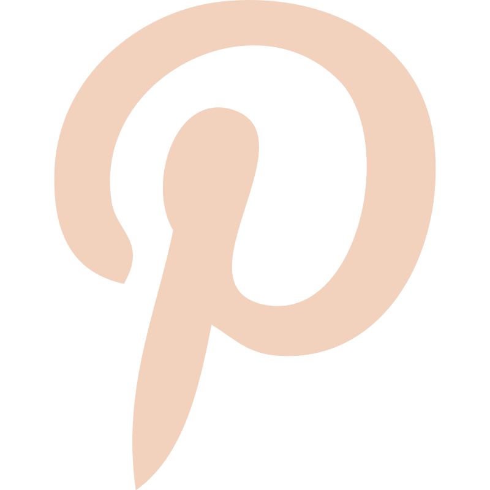
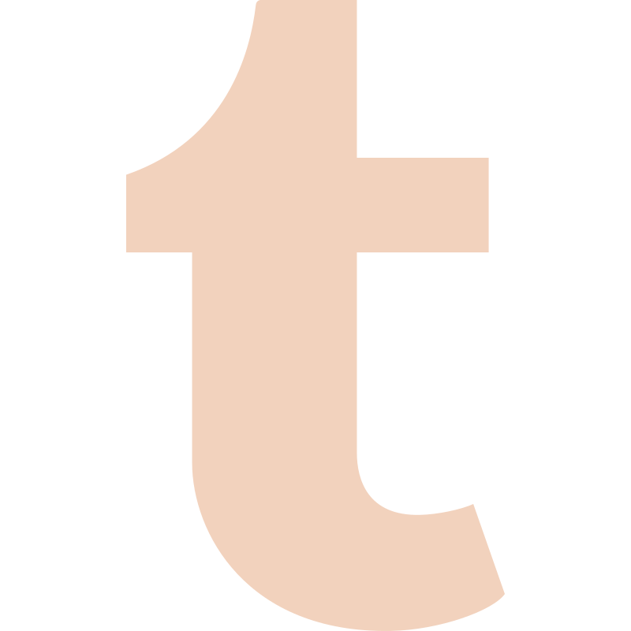

# ¡Hola! Soy Yamil. Un gusto saludarte. ✨

<table>
  <tr>
    <td valign="top" width="55%">
      <h3>Más sobre mí:</h3>
      <ul>
        <li>🌍 Me encuentro en Lima, Perú.</li>
        <li>🔭 Actualmente desarrollando proyectos para mi portafolio.</li>
        <li>🌱 Estudiando Tecnologías Full Stack e IA.</li>
        <li>💫 Me gusta desarrollar proyectos y enseñar lo que aprendo.</li>
      </ul>
    </td>
    <td valign="middle" align="center" width="45%">
      
    </td>
  </tr>
</table>

---

  
  
  

  
  
  

---

### 💻 Proyectos relevantes

<table width="100%">
  <thead>
    <tr>
      <th width="10%">Imagen</th>
      <th width="20%">Nombre</th>
      <th width="50%">Descripción</th>
      <th width="20%">Sitio</th>
    </tr>
  </thead>
  <tbody>
    <tr>
      <td align="center">
        
      </td>
      <td><b>Enlaces para Desarrolladores</b></td>
      <td>🚀⭐ Mi lista con enlaces a herramientas, boletines, blogs y entre otros recursos para desarrolladores (Se actualiza a menudo) 🔥</td>
      <td align="center">
        
      </td>
    </tr>
    <tr>
      <td align="center">
        
      </td>
      <td><b>Sitio Personal</b></td>
      <td>Sitio personalizable con herramientas de publicación para redes, SEO y todo lo demás. En constante desarrollo.</td>
      <td align="center">
        
      </td>
    </tr>
    <tr>
      <td align="center">
        
      </td>
      <td><b>AI Cheatsheets</b></td>
      <td>Una colección de 'Cheatsheets' generados con IA para estudiar y conocer tecnologías software.</td>
      <td align="center">
        
      </td>
    </tr>
    <tr>
      <td align="center">
        
      </td>
      <td><b>Una Comunidad de Python</b></td>
      <td>Comunidad de programación enfocada a Python, se brinda recursos y apoyo entre participantes.</td>
      <td align="center">
        
      </td>
    </tr>
    <tr>
      <td align="center">
        
      </td>
      <td><b>NotebookLM Prompt Styles</b></td>
      <td>🎨 Una colección curada de estilos de diseño visual (YAML) para personalizar la generación de diapositivas en NotebookLM.</td>
      <td align="center">
        
      </td>
    </tr>
    <!-- Duplicar la fila anterior para añadir más proyectos -->
  </tbody>
</table>

---

### Tecnologías y herramientas que uso

y varias más...

  
<b>Últimas publicaciones</b>

   
  <!-- POST-LIST:START -->
<table>
  <tr>
    <td align="center" width="50%">
      <a href="https://yamilayma.github.io/posts/automatizacion/automatizacion-zombi/">
        
         
        Elimina las "Automatizaciones Zombi" y recupera tu presupuesto
      </a>
    </td>
    <td align="center" width="50%">
      <a href="https://yamilayma.github.io/posts/automatizacion/vendor-lockin/">
        
         
        El Riesgo del Vendor Lock-in: No dejes que tu lógica quede atrapada
      </a>
    </td>
  </tr>
  <tr>
    <td align="center" width="50%">
      <a href="https://yamilayma.github.io/posts/automatizacion/datos-sucios/">
        
         
        Datos Sucios: El gran saboteador de la automatización
      </a>
    </td>
    <td align="center" width="50%">
      <a href="https://yamilayma.github.io/posts/automatizacion/centro-de-excelencia/">
        
         
        El Centro de Excelencia: Tu motor de eficiencia escalable
      </a>
    </td>
  </tr>
</table>
<!-- POST-LIST:END -->

  
<b>Entradas recientes del blog</b>

   
  <!-- BLOG-LIST:START -->

- [¡Presentando a todos!](https://yamilayma.github.io/proyectos/notebooklm-prompt-styles/diario/03-presentacion/) - 🗓️ <i>24/04/2026</i>

- [Rostro digital para el proyecto](https://yamilayma.github.io/proyectos/notebooklm-prompt-styles/diario/02-pagina-web/) - 🗓️ <i>23/04/2026</i>

- [[Tutorial] - Sitemap Plano en Astro: El truco para Google Search Console](https://yamilayma.github.io/blog/tutorial/sitemap-plano-astro/) - 🗓️ <i>22/04/2026</i>

- [Un lugar para compartir](https://yamilayma.github.io/proyectos/notebooklm-prompt-styles/diario/01-inicio/) - 🗓️ <i>13/04/2026</i>
<!-- BLOG-LIST:END -->

### Estadísticas

  
<b>Stardev.io - Estadisticas a nivel geográfico</b>

   
  

  

  

